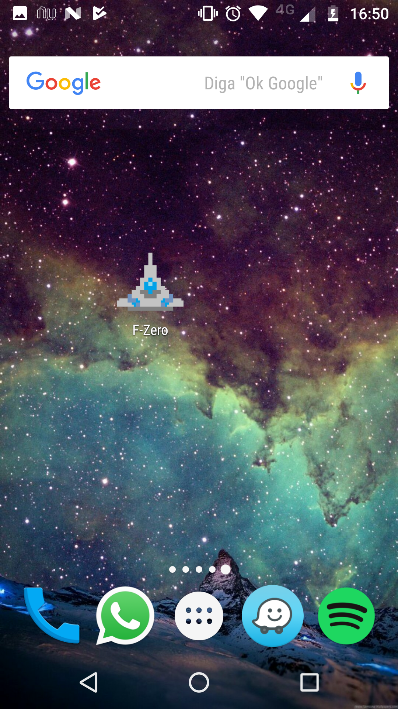
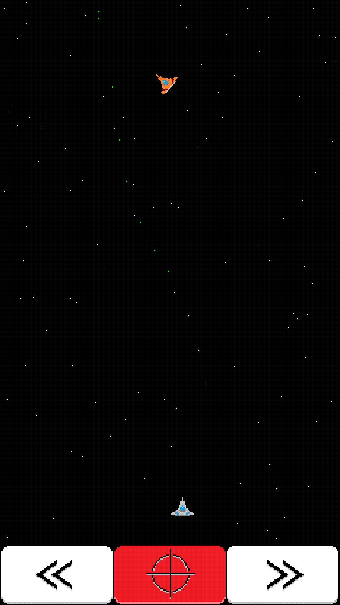

# FromZero-Android

FromZero game for Android

A game implementation built in Python using pygame, pygame_sdl2 and rapt for build on Android.

https://github.com/renpy/pygame_sdl2

https://github.com/renpy/rapt

# Screenshots:

